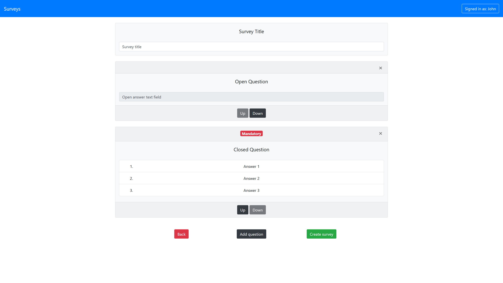

# Exam #1: "Survey"
## Student: s281949 Marino Jacopo 

## React Client Application Routes

- Route `/`: homepage page for the website, used to show available surveys and to login if the user is an admin
- Route `/survey/:id`: page for filling the survey with the corresponding `id`
- Route `/admin`: Initial page for the administrator **(protected by authentication)**
- Route `/admin/newSurvey`: page for creating a new survey **(protected by authentication)**
- Route `/admin/viewSurveys`: page for viewing all surveys created by the admin **(protected by authentication)**
- Route `/admin/survey/:surveyId`: page for viewing the answers given by users to the survey with the corresponding `surveyId` **(protected by authentication)**
- Route `/login`: page used to log in

## API Server

- GET `/api/surveys`
  - description: get all surveys that a user can fill
  - request parameters: *none*
  - response: `200 OK` (success) or `500 Internal Server Error` (generic error)
  - response body content: array of objects, each describing a surveys available (id and title)
    ```
    [{
        "id": 1,
        "title": "Survey1"
    }, {
        "id": 2,
        "title": "Survey2"
    },
    ...
    ]
    ```
- GET `/api/survey/:id`
  - description: get all questions related to the survey with the corresponding `id`
  - request parameters: `id` of the survey
  - response: `200 OK` (success), `400 Bad Request` (error in passed parameter) or `500 Internal Server Error` (generic error)
  - response body content: array of objects, describing the questions of the survey
    ```
    [{
        "id": 1,
        "type": "open",
        "title": "Question 1",
        "answers": "",
        "min": 0,
        "max": 0,
        "mandatory": 0,
        "position": 0
    },{
        "id": 2,
        "type": "closed",
        "title": "Question 2",
        "answers":"[\"MCQ1 answer\",\"MCQ2 answer\",\"MCQ3 answer\",\"MCQ4 answer\"]",
        "min": 2,
        "max": 2,
        "mandatory": 1,
        "position":1
    },
    ...
    ]
    ```
- GET `/api/groupId`
  - description: get the new id used to group answers given by a user
  - request parameters: *none*
  - response: `200 OK` (success) or `500 Internal Server Error` (generic error)
  - response body content: next id to be used for grouping answers
    ```
    5
    ```
- POST `/api/submit`
  - description: submit one single answer given by the user
  - request parameters: *none*
  - request body: object describing the answer to a single question given by the user<br/>
    Closed answer object:
    ```
    {
        "groupId": 5,
        "surveyId": 1,
        "questionId": 1,
        "type": "closed",
        "answer": "[0]",
        "user": "User 1",
        "min": 0,
        "max": 1,
        "numAnswers": 3
    }
    ```
    Open answer object:
    ```
    {
        "groupId": 5,
        "surveyId": 1,
        "questionId": 2,
        "type": "open",
        "answer": "Answer to the open question",
        "user": "User 1",
        "mandatory": 0
    }
    ```
  - response: `200 OK` (success), `400 Bad Request` (error in passed parameters) or `500 Internal Server Error` (generic error)
  - response body content: *none*
- POST `/api/createSurvey`
  - description: create the survey entry in the database with the corresponding questions
  - request parameters: *none*
  - request body: object describing the new survey (`owner` is the admin currently logged in)
    ```
    {
        "title": "Survey title",
        "questions":[{
            "surveyId": -1,
            "type": "open",
            "title": "Question 1",
            "answers": [""],
            "min": 0,
            "max": 1,
            "mandatory": false,
            "position": 0
        },{
            "surveyId": -1,
            "type": "closed",
            "title":"Question 2",
            "answers":["MCQ1 answer","MCQ2 answer"],
            "min": 1,
            "max": 1,
            "mandatory": true,
            "position": 1
        }
        ...
        ],
        "owner": 2
    }
    ```
  - response: `200 OK` (success), `400 Bad Request` (error in passed parameters) or `500 Internal Server Error` (generic error)
  - response body content: *none*
- GET `/api/surveys/admin/:id`
  - description: get all surveys created by the admin logged in
  - request parameters: `id` of the admin
  - response: `200 OK` (success), `400 Bad Request` (error in passed parameter) or `500 Internal Server Error` (generic error)
  - response body content: array of objects, each describing a surveys created by the admin logged in (id, title and number of answers)
    ```
    [{
        "id": 1,
        "title": "Survey1"
    }, {
        "id": 2,
        "title": "Survey2"
    },
    ...
    ]
    ```
- GET `/api/survey/:surveyId/admin/:adminId`
  - description: get all questions related to the survey with the corresponding `surveyId` created by the admin with the corresponding `adminId`
  - request parameters: `surveyId` of the survey and `adminId` of the admin
  - response: `200 OK` (success), `400 Bad Request` (error in passed parameters) or `500 Internal Server Error` (generic error)
  - response body content: object of array of objects, each one describing the answers of the survey given by a user (each key represents a `groupId` and the value associated is the array with the answers given by the user)
    ```
    {
        "4": [{
                  "groupId": 4,
                  "type": "open",
                  "answer": "Answer to open question x",
                  "user": "User 1",
                  "position": 0,
                  "title": "Question 1",
                  "answers": "[\"\"]"
              },{
                  "groupId": 4,
                  "type": "closed",
                  "answer": "[0]",
                  "user": "User 1",
                  "position": 1,
                  "title": "Question 2",
                  "answers": "[\"MCQ answer 1\",\"MCQ answer 2\",\"MCQ answer 3\"]"
              },
              ...
              ],
        "5": [{
                  "groupId": 5,
                  "type": "open",
                  "answer": "Answer to open question y",
                  "user": "User 2",
                  "position": 0,
                  "title": "Question 1",
                  "answers": "[\"\"]"
              },{
                "groupId": 5,
                "type": "closed",
                "answer": "[0]",
                "user": "User 2",
                "position": 1,
                "title": "Question 2",
                "answers": "[\"MCQ answer 1\",\"MCQ answer 2\",\"MCQ answer 3\"]"
              },
              ...
              ],
        ...
    }
    ```

- POST `/api/sessions`
  - description: request to log in an admin
  - request parameters: *none*
  - request body: object describing the user
    ```
    {
        "username": "john@polito.it",
        "password": "1234abcd"
    }
    ```
  - response: `200 OK` (success) or `500 Internal Server Error` (generic error)  
  - response body content: user if the login was successful, error otherwise<br/>
    Successful login
    ```
    {
        "id": 1,
        "username": "john@polito.it",
        "name":"John"
    }
    ```
    Login error
    ```
    {
        "message": "Incorrect username and/or password."
    }
    ```
- DELETE `/api/sessions/current`
  - description: request to log out an admin
  - request parameters: *none*
  - response: `200 OK` (success) or `500 Internal Server Error` (generic error)
  - response body content: *none*
- GET `/api/sessions/current`
  - description: get the status about the user, if he/she is logged in or not
  - request parameters: *none*
  - response: `200 OK` (success) or `401 Unauthorized` (authentication error)  
  - response body content: user if he/she is logged in, error otherwise<br/>
    User already logged in
    ```
    {
    "id": 1,
    "username": "john@polito.it",
    "name":"John"
    }
    ```
    User not logged in
    ```
    {
        "error":"Unauthenticated user!"
    }
    ```

## Database Tables

-  Table `admin` is used to store admin information and the password is not the actual password but its hash. It contains `id` `username` `password` `name`
-  Table `answers` is used to store all answers given by users during filling process. It contains `id` `groupId` `surveyId` `questionId` `type` `answer` `user`
-  Table `questions` is used to store the questions related to a survey. It contains `id` `surveyId` `type` `title` `answers` `min` `max` `mandatory` `position`
-  Table `surveys` is used to store high level information about surveys, then the actual survey to be shown is obtained combining this table and the `questions` one. It contains `id` `title` `owner`

## Main React Components

- `Surveys` (in `Survey.js`): component to generate a list of surveys (for the user side)
- `SurveyItem` (in `Survey.js`): component to generate a single entity survey (for the user side)
- `Questions` (in `Survey.js`): component to generate the list of questions of a survey
- `Question` (in `Survey.js`): single question component, it handles both closed-answer and open-ended questions (the type can be chosen with the props `type`)
- `UserNameField` (in `Survey.js`): username component, it handles the username field before actual questions
- `SurveysAdmin` (in `SurveyAdmin.js`): component to generate a list of surveys (for the admin side)
- `SurveyAdminItem` (in `SurveyAdmin.js`): component to generate a single entity survey (for the admin side)
- `AddNewQuestionModal` (in `SurveyAdmin.js`): component to generate a modal to create a new question (it handles both closed-answer and open-ended questions)
- `QuestionsAdmin` (in `SurveyAdmin.js`): component to generate the list of questions of a survey not yet published (used in the survey creation process)
- `QuestionAdmin` (in `SurveyAdmin.js`): single question component, it handles both closed-answer and open-ended questions (the type can be chosen with the props `type`); this component just shows how the question will be displayed to the users, but fields cannot be filled by the admin during the survey creation process
- `SurveyTitleField` (in `SurveyAdmin.js`): survey title component, it handles the survey title field before actual questions
- `ViewAnswersOneSurvey` (in `SurveyAdmin.js`): component to render all answers from all users (it shows one user at a time, then the admin can move between users' answers using buttons)
- `Login` (in `Login.js`): component to get data from admin for the login
- `UnauthorizedUserMessage` (in `Login.js`): component to render error message if a page is accessed without permissions

(only _main_ components, minor ones may be skipped)

## Screenshot



## Users Credentials

- `john@polito.it`, `1234abcd`
  - Created surveys:
    - *Restaurant review*
    - *Music survey*
    - *Running survey*
- `emily@polito.it`, `5678efgh`
  - Created surveys:
    - *Holiday survey*
    - *Exam test*
  


- username, password (plus any other requested info)
- username, password (plus any other requested info)
